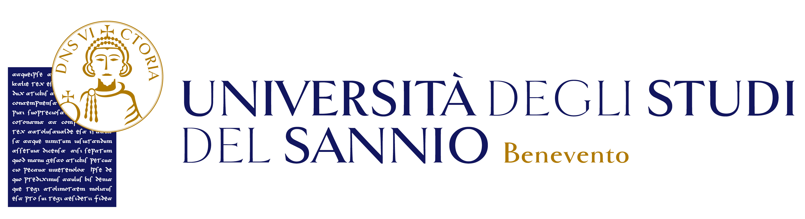

# Short course in Artificial Intelligence for Earth Observation
This course is part of the university course "Reti di Telecomunicazioni" from [Univesity of Sannio](https://www.unisannio.it/), [Engineering Department](https://www.ding.unisannio.it/), given by [Prof. Silvia Liberata Ullo](https://www.unisannio.it/it/user/622/didattica).

The aim is to introduce students to Earth Observation (EO) data, processing techniques and softwares. It also aim to introduce some preliminary concepts of Machine Learning and Deep Learning applied to EO data.

This repository contains slides of the course, exercises and tutorials structured in corrispetive folders.

